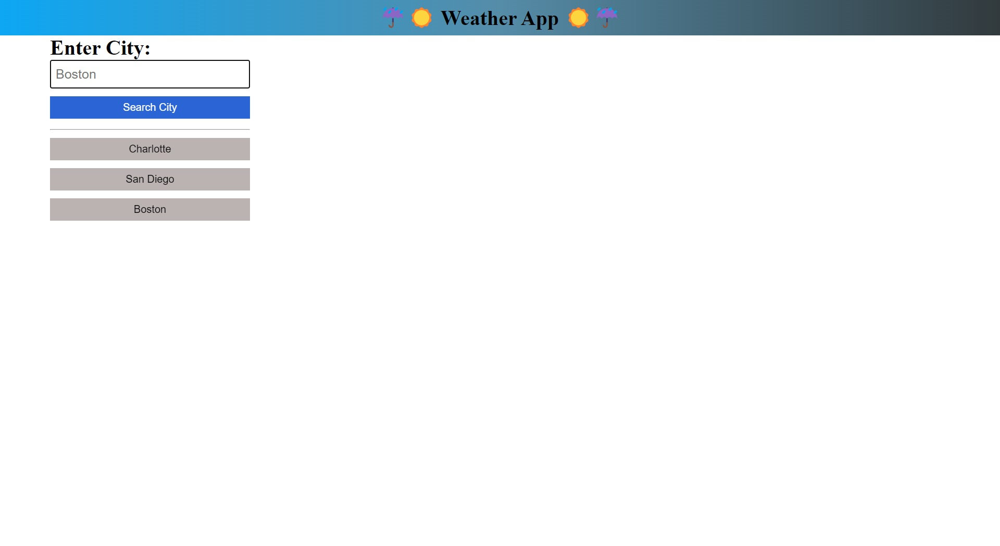
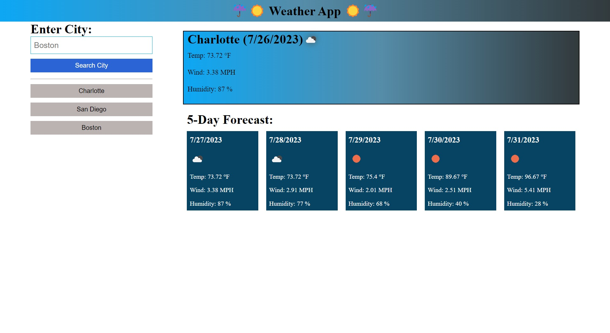
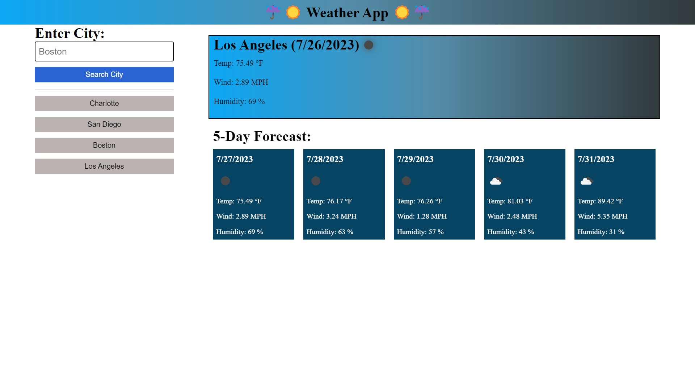
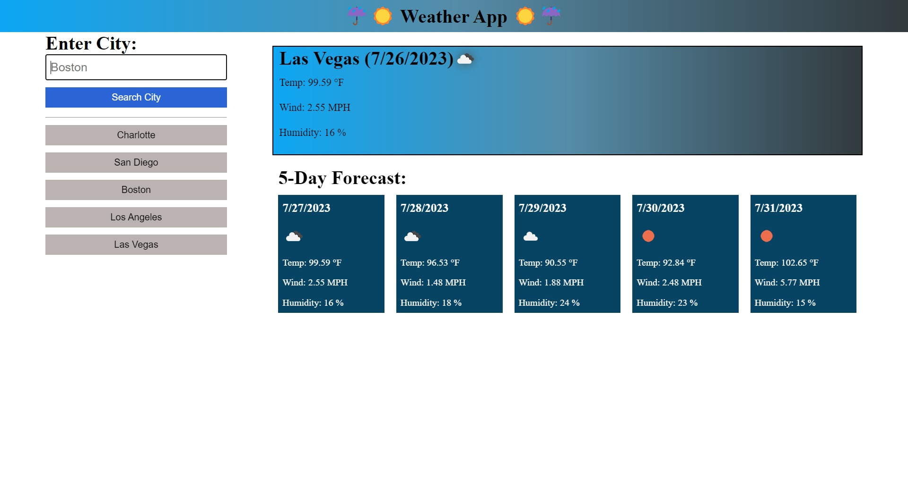

# 🌦 Weather-App 🌞

Weather-App Challenge for UNCC Coding Bootcamp

## User Story

```
AS A traveler
I WANT to see the weather outlook for multiple cities
SO THAT I can plan a trip accordingly
```

## Acceptance Criteria

```
GIVEN a weather dashboard with form inputs
WHEN I search for a city
THEN I am presented with current and future conditions for that city and that city is added to the search history
WHEN I view current weather conditions for that city
THEN I am presented with the city name, the date, an icon representation of weather conditions, the temperature, the humidity, and the wind speed
WHEN I view future weather conditions for that city
THEN I am presented with a 5-day forecast that displays the date, an icon representation of weather conditions, the temperature, the wind speed, and the humidity
WHEN I click on a city in the search history
THEN I am again presented with current and future conditions for that city
```

## 🔗‍💥 Issues Faced During Project

1.  Debugging was crucial in this challenge and pulling the data from the OpenWeather API was a task in itself.
2.  Once I was able to pull data things started to make sense and the next steps will be rendering the information found to the page
3.  Continuing work on JavaScript to try and get fully functional

## 🔎 Preview

 
 

 
 
 

## 🔗 Link to Repo

[https://github.com/JHeeebert/weather-app]

## 🔗 Link to Deployed Site

[https://jheeebert.github.io/weather-app/]

## 🫶 Contributors

Joshua Hebert
Jhebertcocktails@gmail.com

## ☑️ Version History

**See commit history on GitHub Repo**

## 🙏 Acknowledgments

_Thank you Andrew and Will for teaching us the tools needed to make this happen!_

Made with 🖤 by Joshua Hebert
